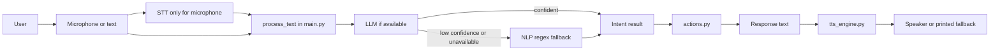
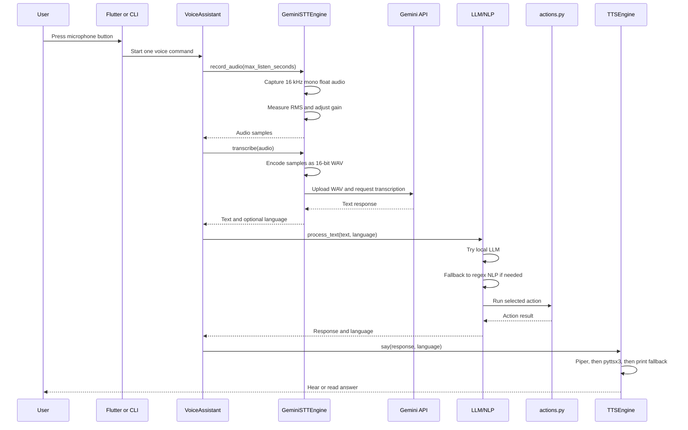
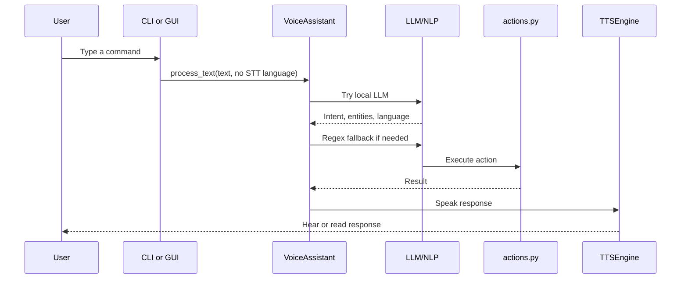
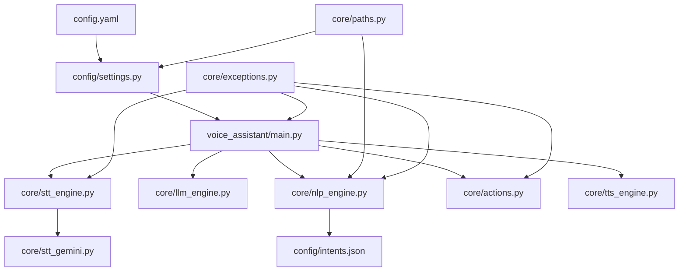

# Complete Voice Assistant Flow

This document connects the files together. There are two doors into the assistant: the microphone door and the text-chat door. After the input becomes text, both doors use the same understanding and action path.

## The whole team



## Flow A: pressing the microphone button

The exact GUI command is a JSON line with `type: "voice_command"`. The CLI can enter the same path through `run_once_voice` or its continuous loop.



### Step-by-step in very simple words

1. The user taps the microphone button.
2. The GUI sends `voice_command` to `GuiSession`, or the CLI calls `run_once_voice`.
3. `main.py` asks the STT factory for the Gemini engine if it is not ready yet.
4. `stt_gemini.py` asks `sounddevice` to listen.
5. It collects one channel of sound at 16,000 samples per second.
6. It checks whether the sound is too quiet or too loud and may adjust gain.
7. It changes the sound numbers into a WAV file held in memory.
8. It uploads that WAV to Gemini and asks for a transcription.
9. Gemini returns words. The engine returns those words to `main.py`.
10. If there are no words, the GUI reports `no-speech` and the journey ends there.
11. Otherwise, the GUI may emit a `transcription` event.
12. `process_text` first asks the local Qwen LLM to understand the words.
13. If the LLM is unavailable, fails, or is unsure, `NLPEngine` checks `intents.json`.
14. The brain finds an intent such as time, date, system information, open app, or web search.
15. It pulls out extra details, such as the app name or search query.
16. `actions.py` performs the real action.
17. A response sentence is returned.
18. `tts_engine.py` tries the correct Arabic or English Piper voice.
19. If Piper cannot speak, it tries pyttsx3, then prints the answer.
20. The user hears the answer, or sees it as a final fallback.

## Flow B: text chat

Text chat skips the ears. It begins with a typed string from the CLI `--text` option or a GUI `text_command` JSON line.



### Step-by-step in very simple words

1. The user types something like `what time is it`.
2. The CLI or GUI sends the text to `VoiceAssistant.process_text`.
3. There is no microphone and no Gemini STT call.
4. Because there is no STT language, the LLM or NLP engine detects the language from the text.
5. The local LLM tries first when enabled and loaded.
6. NLP uses regex examples from `config/intents.json` if the LLM cannot help.
7. The chosen action runs in `core/actions.py`.
8. The result becomes a response sentence.
9. The response is spoken by Piper or a fallback engine.
10. In GUI mode, a `response` event and then `tts_playing` event are also sent back.

## Which files touch one request?



## A tiny example

For `open vscode`:

```text
words -> open_app intent -> app=vscode -> find executable -> launch VS Code -> speak success
```

For `search for Python tutorials`:

```text
words -> web_search intent -> query=Python tutorials -> open Google -> speak search status
```

For `what time is it`:

```text
words -> get_time intent -> read current clock -> speak the time
```

The important connection is this: voice and text are different beginnings, but they share the same middle and ending.
