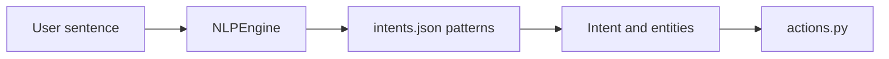

# `config/intents.json`

## What is this file?

This is the command picture book for the regex NLP brain. It lists sentences the assistant knows.

## Each intent entry contains

- `name`: the internal command name.
- `patterns_en`: English examples.
- `patterns_ar`: Arabic examples.
- `entities`: pieces to pull out, such as `app` or `query`.
- `response_template_en`: English response shape.
- `response_template_ar`: Arabic response shape.

## The five commands

1. `get_time`: asks for the current time.
2. `get_date`: asks for today's date.
3. `get_sys_info`: asks about CPU, memory, or disk.
4. `open_app`: asks to open an application and captures its name.
5. `web_search`: asks to search and captures the query.

For example, `search for {query}` means “search for” is fixed, while the rest becomes the `query` entity.

## Picture

To teach the regex brain a new phrase, add it to the correct language pattern list while keeping valid JSON.
