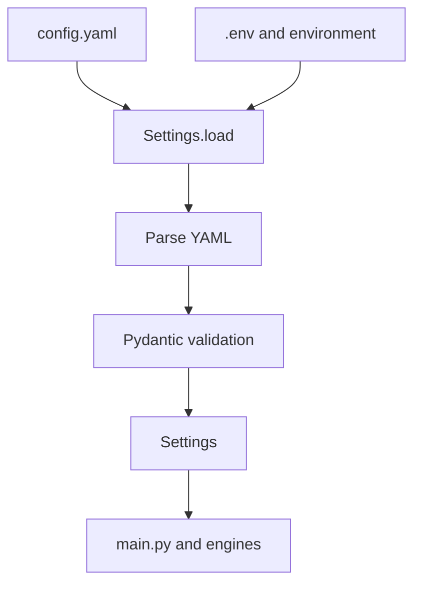

# `config/settings.py`

## What is this file?

This is the settings teacher. It reads configuration and checks that every value has a sensible shape.

## Small helpers

- `_anchor_path` changes a relative model path into an absolute path under the project root.
- `_load_dotenv` reads simple `KEY=VALUE` lines from `.env`. Existing environment variables win.

## Configuration boxes

Pydantic models describe each box and validate its values:

- `STTConfig`: Gemini provider, API key, language hints, recording time, gain, and timeout.
- `TTSConfig`: Piper or pyttsx3, volume, speed, and voice files.
- `NLPConfig`: confidence thresholds for English and Arabic.
- `AudioConfig`: sample rate and channel count.
- `LogConfig`: DEBUG, INFO, WARNING, or ERROR.
- `LLMConfig`: local GGUF model path and llama.cpp tuning.

The models are frozen, so a loaded settings object cannot be accidentally changed in place.

## `Settings.load`

1. Load `.env` from the project root.
2. If the YAML file is missing, use defaults.
3. Read YAML safely.
4. Turn YAML data into validated settings.
5. Let `VA_` environment variables override nested values using `__`, such as `VA_STT__GEMINI_API_KEY`.

## Picture

This file keeps configuration decisions out of the business logic.
