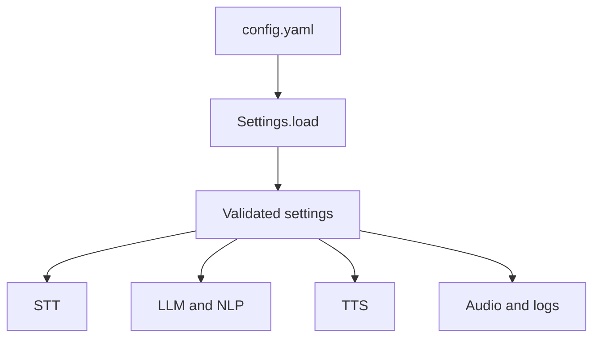

# `config.yaml`

## What is this file?

This is the project's control panel. It gives the engines their starting choices.

## Sections

- `stt`: use Gemini, listen for up to five seconds, allow Arabic and English, and use automatic gain.
- `tts`: prefer local Piper voices, with medium voices and low-quality fallbacks.
- `nlp`: choose confidence thresholds for intent matching.
- `llm`: enable the local Qwen GGUF model, allow NLP fallback, and set token, context, GPU, and thread limits.
- `audio`: record mono sound at 16,000 samples per second.
- `log`: start at INFO logging.

The Gemini API key is intentionally blank here. It should come from `GEMINI_API_KEY` or `VA_STT__GEMINI_API_KEY`.

## Picture

The YAML file chooses behavior; the Python classes enforce that the choices are valid.
