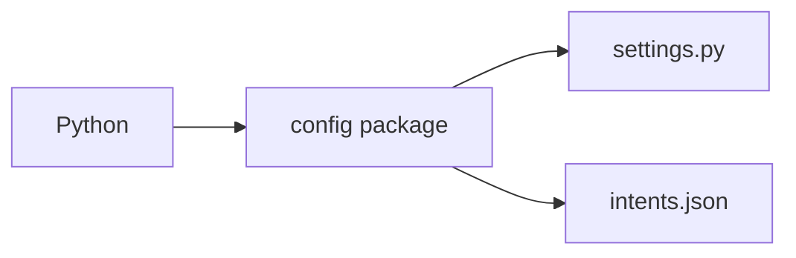

# `config/__init__.py`

This file marks `config/` as a Python package. It has no application logic of its own.

It lets Python import the settings module using package syntax:

```python
from config.settings import Settings
```


