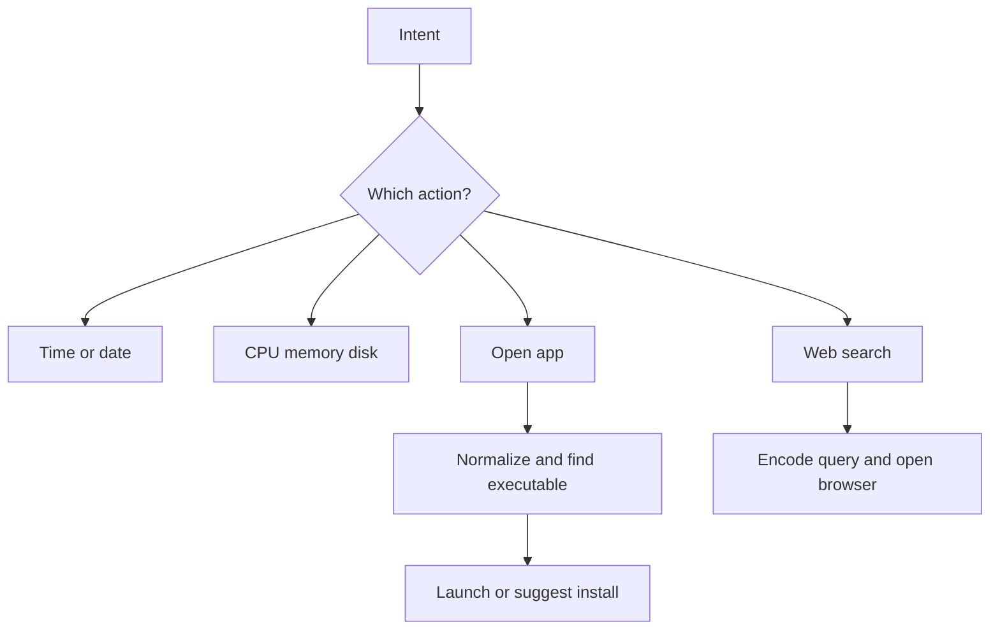

# `core/actions.py`

## What is this file?

This file contains the assistant's hands. It performs real computer actions.

## Time, date, and system info

- `get_time` returns the current time in English or Arabic.
- `get_date` returns the current date with localized weekday and month names.
- `get_sysinfo` asks `psutil` for CPU, memory, and root-disk usage.

## Opening applications

`open_app` uses several safety and convenience steps:

1. Create example user aliases if needed.
2. Normalize the requested name.
3. Translate common Arabic tech words.
4. Check user aliases.
5. Build or reuse an index of executable files and desktop files.
6. Try an exact match.
7. Try fuzzy matching.
8. If missing, search `dnf` and `flatpak` for install suggestions.
9. If confirmed, start installation in a background thread.
10. Launch with `subprocess.Popen` when found.

The module also contains Arabic normalization, transliteration, desktop-file parsing, caching, and localized messages.

## Web search

`web_search` URL-encodes the query, creates a Google search URL, opens a browser tab, and returns a status message.

## Picture

These functions are where a sentence becomes a visible change on the computer.
