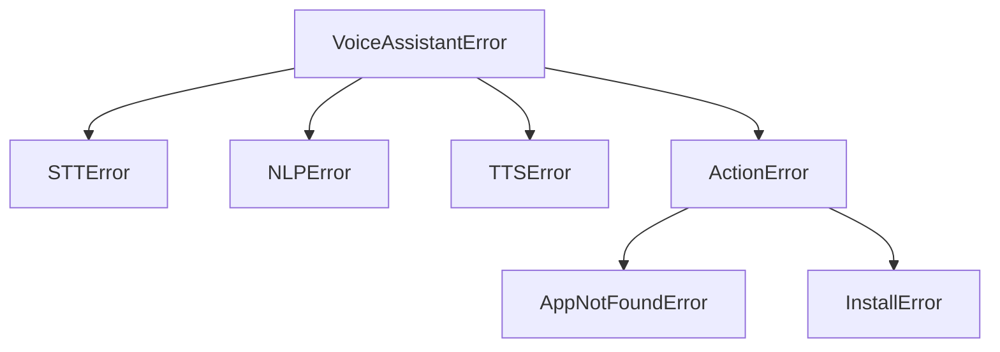

# `core/exceptions.py`

## What is this file?

This file creates named error types. A named error is like a colored warning card: it tells us which part had trouble.

## The error family

- `VoiceAssistantError`: the parent error for the whole application.
- `STTError`: the ears could not record or transcribe.
- `NLPError`: the brain could not understand the sentence.
- `TTSError`: the mouth could not speak.
- `ActionError`: a computer action failed.
- `AppNotFoundError`: the requested application was not found.
- `InstallError`: installing a missing application failed.

All child errors inherit from `VoiceAssistantError`, so callers can catch one broad family or one exact problem.

## Picture

## Connection

The engine files raise these errors. `main.py` catches them and gives the user a useful response instead of crashing silently.
