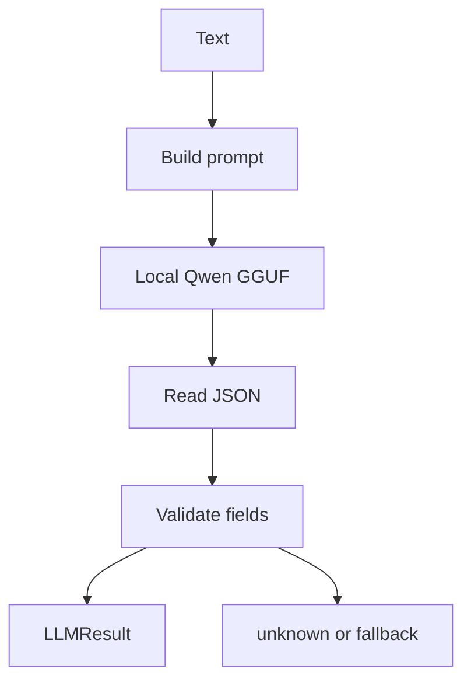

# `core/llm_engine.py`

## What is this file?

This file is an optional local language brain. It uses a GGUF Qwen model through `llama_cpp` to understand Arabic, English, and mixed commands.

## `SYSTEM_PROMPT`

This long instruction tells the model to return only JSON with:

- an intent,
- entities,
- language,
- response text,
- confidence,
- short reasoning.

It also gives app mappings and examples of Egyptian Arabic.

## `LLMResult`

This dataclass is a tidy box for the model's answer. It holds the parsed fields and the original raw answer for debugging.

## `LLMEngine`

- `_load_model` loads the local model when enabled. If loading fails, the engine becomes unavailable.
- `is_available` checks whether the model is ready.
- `_detect_language_from_text` checks Arabic Unicode characters.
- `parse_intent` builds a prompt, calls the model, extracts JSON, validates it, and returns `LLMResult`.
- `generate_response` asks the model for a natural TTS sentence after NLP fallback.
- `_build_prompt` combines system instructions, user text, STT language, and optional context.
- `_parse_json_response` finds a JSON object inside model output.
- `_validate_result` limits intents, languages, and confidence, and requires `app` or `query` entities where needed.

## Picture

The LLM is the first parser when enabled. `main.py` uses the regex NLP engine when the LLM is missing, fails, or is not confident enough.
