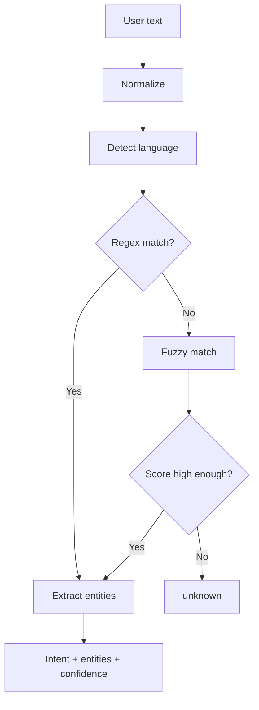

# `core/nlp_engine.py`

## What is this file?

NLP means **natural language processing**. This file looks at words and decides what the user wants.

## Loading the command book

When `NLPEngine` starts, `_load_intents` reads `config/intents.json`. For every command it:

- stores the intent name,
- turns patterns into regular expressions,
- prepares English and Arabic pattern lists,
- stores response templates.

Words inside braces become entities. For example, `search for {query}` captures the search words.

## Understanding one sentence

`parse` follows this order:

1. Trim and lowercase the text.
2. Detect Arabic or English.
3. Try exact regex patterns.
4. Extract entities such as `app` or `query`.
5. Infer a common app name when an Arabic app phrase matched.
6. If exact matching fails, use fuzzy matching with `SequenceMatcher`.
7. Compare the score with the language-specific threshold.
8. Return intent, entities, and confidence, or `unknown`.

## Supported intents

- `get_time`
- `get_date`
- `get_sys_info`
- `open_app`
- `web_search`

## Picture

`get_response_template` supplies a friendly English or Arabic unknown message. The `patterns` property keeps an older combined-pattern interface working.
