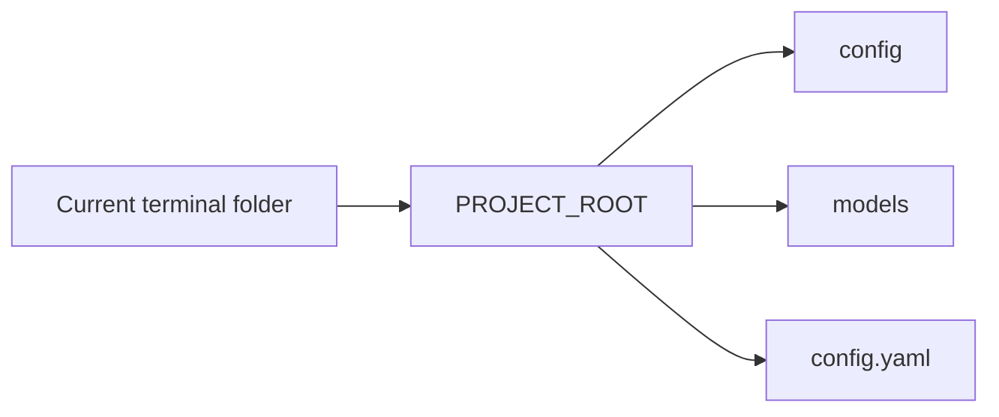

# `core/paths.py`

## What is this file?

This file finds the project folder. It calls that folder `PROJECT_ROOT`.

```python
PROJECT_ROOT = Path(__file__).resolve().parents[1]
```

In simple words: start at this file, find its real location, and move up to the repository folder.

## Why is that useful?

The program can be started from different folders and still find:

- `config.yaml`
- `config/intents.json`
- `models/llm/...`
- `models/tts/...`

## Picture



This file is tiny, but it gives the rest of the project one reliable map.
