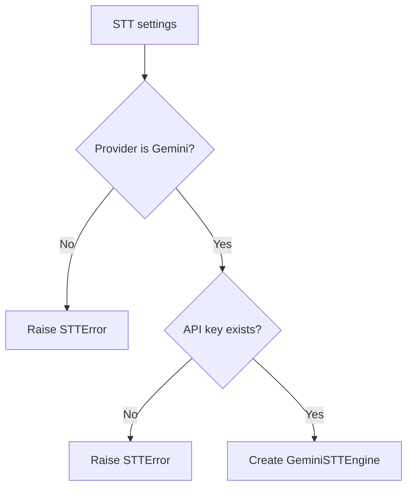

# `core/stt_engine.py`

## What is this file?

STT means **speech to text**. This file defines the shape of an STT engine and creates the correct engine.

## `STTEngineBase`

This is a `Protocol`. Think of it as a promise card. Any STT engine must be able to:

- record audio,
- transcribe audio,
- test the microphone,
- change gain,
- change language,
- close itself.

The rest of the program can use this promise without knowing every implementation detail.

## `create_stt_engine`

This factory checks two things:

1. The provider must be `gemini`.
2. A Gemini API key must exist in configuration or `GEMINI_API_KEY`.

Then it imports and returns `GeminiSTTEngine`.

## Connection

`voice_assistant/main.py` asks this file for an STT engine. The factory keeps provider selection in one safe place.
