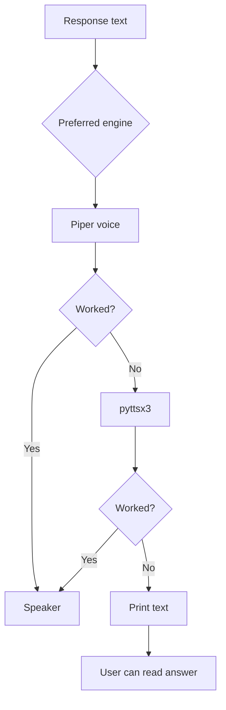

# `core/tts_engine.py`

## What is this file?

TTS means **text to speech**. This file is the assistant's mouth.

## `TTSEngine.say`

It chooses a language, then tries to speak using the configured engine. If that fails, it tries another method, and finally prints the text.

The normal fallback path is:

```text
Piper primary voice -> Piper fallback voice -> pyttsx3 -> printed text
```

## Piper

`_say_piper` chooses Arabic or English voice names, checks for ONNX voice files, loads Piper, turns text into audio chunks, joins them, and plays them with `sounddevice`.

## pyttsx3

`_say_pyttsx3` uses the operating system's offline speech system. It applies rate, volume, and an optional voice ID.

## gTTS

`_say_gtts` is kept for compatibility. It uses the online Google TTS service, saves an MP3 temporarily, looks for a player such as `mpv` or `ffplay`, plays it, then deletes the temporary file.

## Final fallback

`_say_fallback` prints `[TTS fallback]` plus the response so the user still sees an answer.

## Picture


