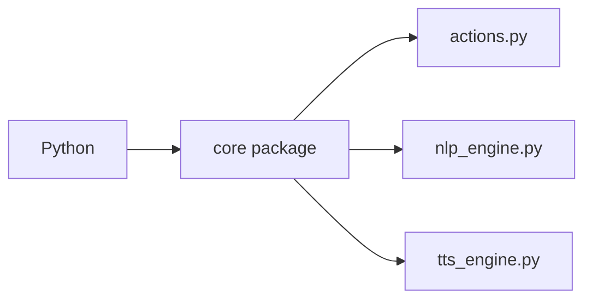

# `core/__init__.py`

## What is this file?

This file tells Python that `core` is a package. A package is like a labeled box where related Python files live.

## What does it do?

It does not run assistant logic. It simply lets other files import things such as:

```python
from core.actions import get_time
```

## Picture



## Connection to the project

The files inside `core/` contain the reusable engine and action pieces. `voice_assistant/main.py` is the director that uses them.
