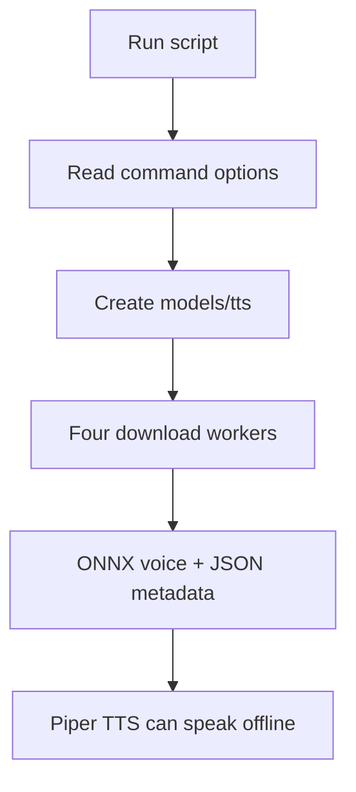

# `scripts/download_models.py`

## What is this file?

This setup helper downloads the four Piper speech voices used by the assistant.

## Voice list

`PIPER_VOICES` maps each friendly voice name to:

- the Hugging Face repository,
- the ONNX model file,
- the JSON voice description,
- the local folder name.

There are Arabic and English voices, each with medium and low variants.

## How downloading works

- `download_piper_voice` validates a voice name, skips a non-empty existing folder, creates the folder, and downloads both files.
- `download_piper_voices_parallel` runs downloads in up to four worker threads.
- `main` reads `--tts-voices` and `--models-dir`, creates `models/tts`, downloads voices, and returns `0` for success or `1` for failure.

## Picture

This script prepares files. It is not part of every conversation.
