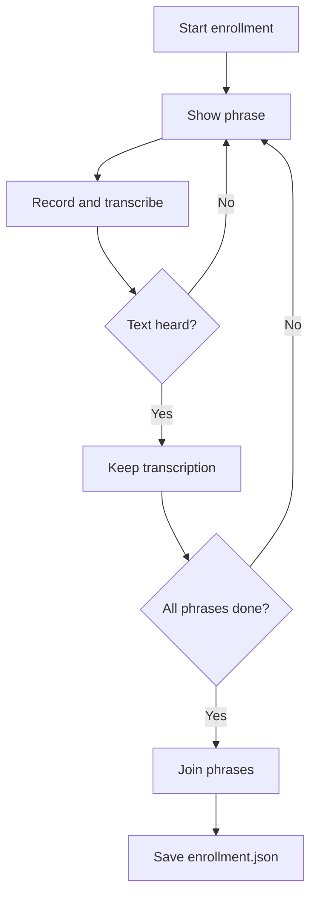

# `voice_assistant/enrollment.py`

## What is this file?

Enrollment gives Gemini example phrases from the user's voice. It is like showing the listener a few examples before the real conversation.

## Stored pieces

- `ENROLLMENT_PHRASES`: six Arabic and English phrases.
- `ENROLLMENT_FILE`: `~/.config/voice-assistant/enrollment.json`.
- `load_enrollment`: reads the saved `initial_prompt` if it exists.
- `save_enrollment`: creates the directory and writes JSON.

## CLI enrollment

`run_enrollment`:

1. Shows one phrase.
2. Waits for Enter.
3. Records audio.
4. Transcribes it.
5. Keeps successful text.
6. Joins all captured text into one prompt.
7. Asks whether to save it.

A failed phrase is skipped. If none succeed, nothing is saved.

## Picture

The GUI has a matching interactive flow in `gui_mode.py`. The next normal process start can load the saved prompt.
