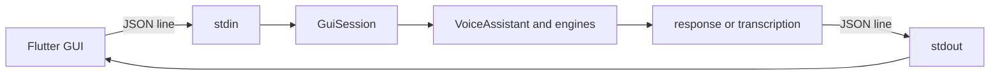

# `voice_assistant/gui_mode.py`

## What is this file?

This file is a small bridge between a Flutter screen and the Python assistant. They talk using one JSON object per line.

## The protocol rule

- Python reads commands from stdin.
- Python writes events to stdout.
- Logs go to stderr, so stdout stays clean for the GUI.

Commands include `voice_command`, `text_command`, `test_mic`, `settings`, and enrollment commands. Events include `status`, `transcription`, `response`, `tts_playing`, `error`, `mic_test_result`, and `enroll_state`.

## Command handlers

- `_handle_voice_command`: listening, transcription, processing, response, speaking.
- `_handle_text_command`: validate text, process it, respond, speak.
- `_handle_test_mic`: run the microphone test and send metrics.
- `_handle_settings`: change gain, automatic gain, or forced language.
- Enrollment handlers: start, record phrases, cancel, and save enrollment.
- `_dispatch`: choose the handler by the JSON `type` field.

## Main loop

`run` announces `ready`, reads lines until EOF or a signal, parses JSON, dispatches commands, reports malformed input, then announces `stopped`.

## Picture

The bridge does not duplicate assistant logic. It forwards work to the same `VoiceAssistant` used by the CLI.
