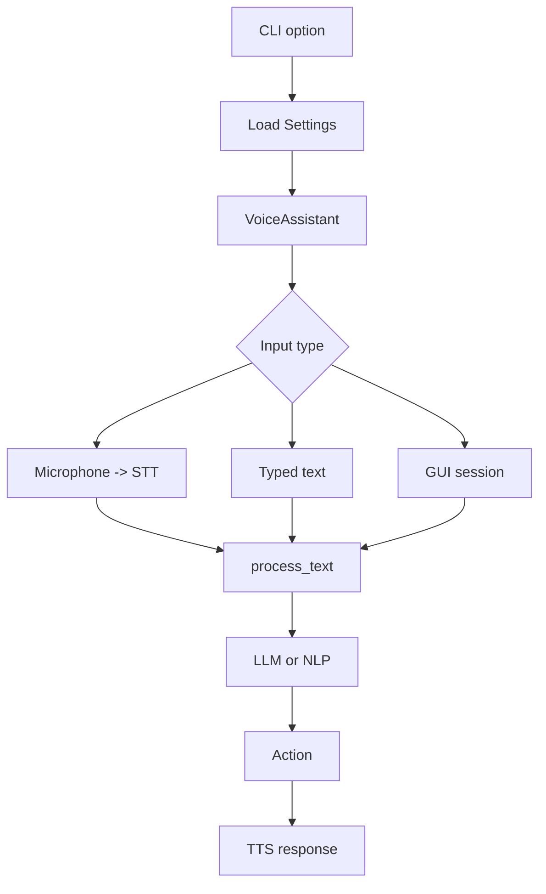

# `voice_assistant/main.py`

## What is this file?

This is the director and command-line front door. It connects configuration, ears, brains, hands, and mouth.

## `VoiceAssistant`

The constructor stores settings, loads any enrollment prompt, and prepares empty engine slots. Properties create STT, NLP, TTS, and LLM engines only when first needed. This is called lazy loading.

## `process_text`

This is the shared thinking path:

1. Try the local LLM when enabled and loaded.
2. Accept a high-confidence LLM result.
3. Otherwise use `NLPEngine.parse`.
4. Reject unknown or low-confidence results with a localized message.
5. Execute the selected action.
6. Return response text and language.

`_execute_llm_intent` handles LLM results. `_execute_nlp_intent` handles regex results and formats time, date, system information, app, and search responses.

## Interaction modes

- `run_once_voice`: record, transcribe, process, and speak once.
- `run_once_text`: process typed text and speak once.
- `run_listen_loop`: repeat voice interactions until Ctrl+C or a termination signal.
- `run_mic_test`: display audio quality information.

## Click command

`cli` loads `config.yaml`, configures stderr logging, and chooses `--listen`, `--once`, `--text`, `--gui-mode`, `--list-intents`, `--enroll`, or microphone-test behavior.

## Picture

Nearly every user request passes through this file, which is why it is the best file for understanding the whole application.
