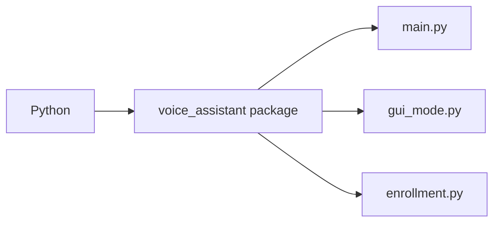

# `voice_assistant/__init__.py`

This file marks `voice_assistant/` as the application package. It contains no runtime logic.

It allows Python to import the director and supporting features:

```python
from voice_assistant.main import VoiceAssistant
```


